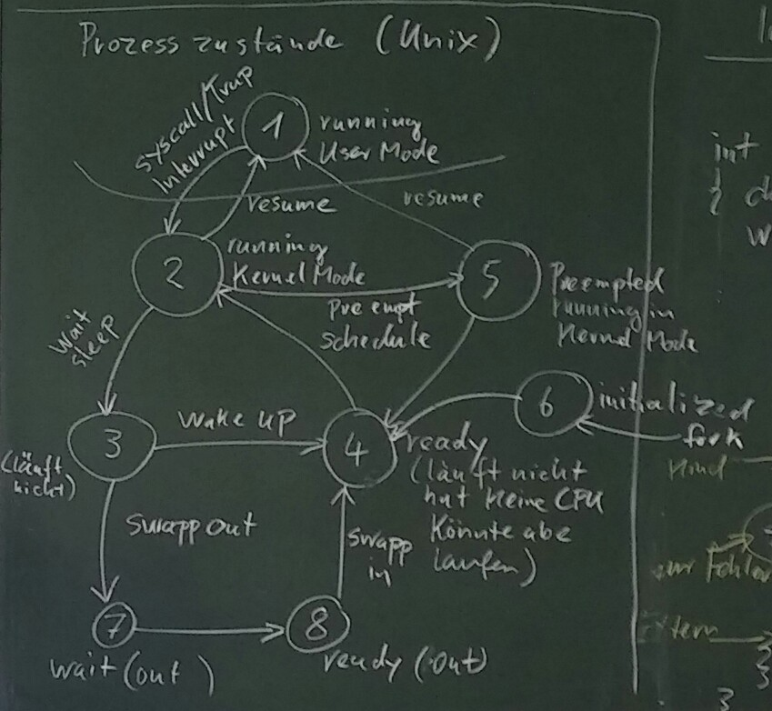

# Vorlesung Betriebssysteme 1

## Organisatorisches, Vorlesung vom 16.03.2016
1. Praktikum
    1. Start vsl. 04.04.2016
    1. Moodle-Passwort: DOS1.0
1. Themen
    1. Übersicht
    1. Grundlagen Rechnerarchitektur (RA)
    1. Prozesse, Threads, Interrupts
    1. Scheduling
    1. Synchronisation
    1. Memory Management (File System)
    1. (I/O)
    1. (Security)
    1. (Design & Implementation)
    1. (Virtualisierung)
    1. (Multiprocessors)
1. Klausur gemeinsam mit Vogt
1. Literatur
    1. Tanenbaum: Modern OS
    1. Silberschatz: OS Concepts
    1. Bovet: Understanding the Linux Kernel
    1. Russinovich: Windows Internals
1. Themen der heutigen Vorlesung
    1. Geschichte von Unix und Windows
    1. Was ist bzw. macht ein OS?
    1. User Mode und Kernel Mode

## Grundlagen Rechnerarchitektur (RA), 23.03.2016

### Wozu braucht das OS Hardware-Unterstützung?
Wiederholung: Wozu braucht man ein OS?
1. Schnittstelle für Systemprogramme
1. Schnittstelle für Anwenderprogramme
1. UI
1. Antwort: **Verwendung von Ressourcen, Rechten, Synchronisation und Kommunikation**

### Rechte
Die CPU hat einen Kernel-/Privileged-Mode und einen User Mode:

Kernel-/Privileged-Mode | User Mode 
---- | ---- 
alle Rechte | eingeschränkte Rechte |
x86 Real Mode: ohne Rechteverwaltung, Protected Mode: 4 priviledged Level | Tendenz: möglichst wenig im Kernel Mode machen (micro Kernel), User Mode Driver (Windows), User Mode File System (Unix) 
MMIX: negative Adressen | MMIX: positive Adressen 
Beschränkte Einsprungpunkte inkl. Rechtekontrolle | Wie kommt man in den Kernel Mode? a) Syscalls, interne Spezial-Instruktionen b) Interrupts; DTRAP/FTRAP, synchr. Interrupts Einschränkungen
 | Einschränkungen des Registerzugriffs; MMIX: rK, x86: PSW (program status word enthält die Mode Bits)
 | Einschränkungen bei den Instruktionen; x86 in/out (Zugriff auf Ports) `OR AX, 0xFF` und `OUT #21, AX`. `#21` ist das Interrupt Mask Register des PIC (Program Interrupt Controller)

### Ressourcen
1. CPU-Zeit: Userprozess darf CPU nur für eine bestimmte Zeit nutzen. Das OS hat und holt sich die Kontrolle zurück:
    1. syscall ==> Userprogramm muss warten
    1. timer interrupt; time slice läuft ab ==> Prozesswechsel
1. Memory
1. (Segmentation)
1. page tables (PT) ==> Im User Mode immer nur so: virtuelle Adressen (Programm/CPU), physikalische Adressen (Bus/RAM)
    1. Die PT ist eine Tabelle, die für jede *page number* eine *frame number* und außerdem Zusatzinformationen enthält.
    1. *page number*: `20 Bit + 12 Bit` offset
    1. 4 GB RAM und 32 Bit Adressraum ==> ca. 1 Millionen pages `2^20` und ca. 4 MB PT pro Prozess. Für die meisten Programme sind 4 MB PT viel zu viel.
        1. *Large tables* beim x86: 2 MB und 4 MB pages
        1. zweistufige PT
    1. Spezielle Caches TLB (Translation Lookaside Buffer) machen die PT-Übersetzung in Hardware mit 8 bis 256 Einträgen. 
    
## Prozesse Threads Interrupts, Vorlesung vom 30.03.2016

### Prozesse
* früher: 
    - Prozess = Job = Task
    - Speicher für Code und Daten
    - Rechte für Device-Zugriff
    - CPU für Ausführung von Code
* heute: 
    - komplexer durch Multiprogramming/-threading/-tasking
    - mehrere CPUs führen den Code gleichezeitig aus
    
### Threads
1. Abstraktion über die Anzahl der verfügbaren CPUs
1. Ein Thread verkörpert eine "virtuelle" CPU, die den Code ausführt
1. sind die ausführbaren Einheiten
1. **Exkurs** heute; Prozess = 
    - Adressraum ==> Zuordnung von Speicher nach Bedarf
    - Rechte ==> Zugriff auf "virtuelle Devices" über Handles (z.B. Filesystem)
    - Threads ==> Zuordnung von CPUs nach Bedarf = *Scheduling*
1. Ein Prozess hat mindestens einen - oft aber mehrere - Threads
1. alle Threads eines Prozesses teilen sich den gemeinsamen Adressraum (Speicher) und die gleichen Zugriffsrechte (Handles)
1. **Jeder Thread**
    1. hat seinen eigenen Registersatz, insbesondere Program Counter (PC) und Stack Pointer (SP),
    1. hat seinen eigenen Stack für lokale Variablen und Rücksprungadressen von Funktionen,
    1. und wird nach Bedarf und Verfügbarkeit eine CPU zugeordnet.

### Interrupts (Unterbrechnungen)
1. asynchrone/externe/HW-Interrupts
1. synchrone/interne/Exceptions/SW-Interrupts (z.B. Division durch 0, page fault)

#### HW-Interrupts

```
                      PIC (Programmable Interrupt Controller)   |
+---------+         +---------+                                 | MMIX
|         |---------|   IRQ   |                                 | +----+
|   CPU   |         |   IRM   |                                 | | rQ |-
|         |         +---------+                                 | | rK |-
+---------+          |||||||||      PIC                         | +----+
                           |_____+---------+                    |
                                 |   IRQ   |                    |
                                 |   IRM   | Interrupt Mask Register
                                 +---------+
                                  ||||||||| 
```

### Was passiert, wenn ein Interrupt auftritt?
1. externer Interrupt wird einer CPU zugewiesen. Interne Interrupts haben bereits eine CPU. 
1. CPU unterbricht Ausführung des laufenden Threads. 
1. CPU wechselt von User Mode in Kernel Mode.
1. Der Thread Kontext (PC, SP, ...) wird (teilweise) gesichert (context switch light). 
1. Der Interrupt Handler wird ausgewählt. Geschieht meist über eine Sprungtabelle (Interrupt Vektor)
1. Der Handler wird ausgeführt. 
1. Der Thread-Kontext wird wieder hergestellt.
1. CPU wechselt in User Mode.
1. Der Thread wird an der ursprünglichen Stelle weiter ausgeführt.

### Interrupt Priorities
1. Jeder Interrupt hat eine zugeordnete Priority.
1. Prio. des laufenden Threads in einem Register (CPU/PIC)
1. Interrupt mit höherer Prio. unterbrechen Interrupts mit niedrigerer Prio (wenn enabled).
1. (Bemerkung: Man kann Interrupt Priorities im Kernel auch für Synchronisation verwenden)

### Vorteile von Threads
1. Vermeiden von Wartezeiten auf IO
1. effizientere Nutzung der CPU
1. Echte Parallelität mit mehreren CPUs
1. Threadwechsel sind billiger als Prozesswechsel
1. Bessere Strukturierung von Programmen
1. Kommunikation zwischen Threads ist effizienter als zwischen Prozessen (über gemeinsame globale Datenstrukturen)

### Nachteile von Threads
1. Overhead Threadwechsel
1. Synchronisation ist komplex (data race)

### Zustände von Threads
Zustände von Threads (s. Abbildung)

1. running current: Thread hat CPU und läuft
1. blocked/waiting: Thread hat nichts zu tun und braucht keine CPU
1. ready: Thread könnte laufen, hat aber keine CPU


Hinweise:

1. Wenn dem OS die CPU entzogen wird, stehen **alle** User Level Threads
1. Wenn ein User Level Thread warten muss, müssen alle warten. 

## Prozesse, Threads, Interrupts am Beispiel Windows, Vorlesung vom 06.04.2016
wird nachgetragen

## Prozesse und Threads in Unix (Unix/Linux/Posix), Vorlesung vom 13.04.2016

### Wie erzeugt man in Unix einen Prozess?
1. `int fork();` keine Parameter
1. Rückgabewert
    * `< 0` Fehler
    * `= 0` Kind Prozess
    * `> 0` ProzessID des Kind-Prozesses im Eltern Prozess.
1. erzeugt ein Duplikat des laufenden Prozesses
    * ==> Sehr einfaches Konzept
    * ==> **Aber:**
        - Mutexe?
        - Handles?
        - Offene Dateien?
        - Threads? Nur der Thread, der fork() aufruft wird gestartet.
    * Es wird (wurde) **alles** kopiert!
    * Semantik ist nicht so ganz klar.
    * Speicher?
        1. heutzutage mit PageTables und "Copy on Write"
        1. Kopie der PageTables
        1. Sämtliche Einträge der PageTable werden *read only* gesetzt.
        1. "Leben im gleichen Speicher, solange nicht in diesen geschrieben wird."
        1. Beim ersten Schreibzugriff auf eine Seite bekommt man einen PageFault. Daraufhin bekommt jeder der Prozesse seine eigene Kopie.
1. Bootvorgang:
    * ProzessID 0 wird zum swap Prozess
        * mit fork() wird ProzessID 1 (init) erzeugt
            * init erzeugt alle weiteren Prozesse
                * getty
                    * bash
                        * gcc
                    * exit
                * weiterer Prozess
                * ...

#### Im Interrupt Handler
Beispiel: Eine einfache Shell

```
int main() {

char buffer[200];
int pid, status;

while(1) {
    fputs(">", stdout);
    fgets(buffer, 200, stdin); // lese input zeile in Konsole
    pid = fork(); // Prozess teilt sich auf: zwei bash

    if(pid < 0) {
        fputs("Error\n",stdout);
        return 1;

    } else if(pid == 0) { // "hier geht der Kind-Prozesses rein"
        buffer[strlen(buffer)-1] = 0; // Entfern \n am Zeilenende
        /*
         * Startet ein neues Programm, indem der gesamte Adressraum überschrieben wird.
         * Genauer: Die PageTables
         */
        status = execlp(buffer, "", 0);
        return status;
    } else { // "hier geht der Eltern-Prozesses rein"
        wait(&status); // wartet auf das Ende des Kind-Prozesses und erhält dessen Exit-Status.
    }
}
```

## Terminierung

1. `exit(status) // system call, geht an den Eltern-Prozess` ==> Files werden geschlossen Handles freigegeben.
1. Was passiert, wenn der Elternprozess nicht auf den Kindprozess wartet?
    * ==> Die Datenstruktur für den Prozess wird aufgehoben solange bis der Eltern-Prozess den Exitstatus bekommt.
    * ==> Der Kind-Prozess ist ein Zombie
    * Ausnahmen:
        - Der Eltern-Prozess kann das SIGCHLD Signal auch ignorieren oder abfangen.
        - Wenn der Eltern-Prozess vor dem Kind-Prozess temriniert, dann wird der Kind-Prozess (orphan, Waisenkind) vom init-Prozess adoptiert.

## Prozess-Zustände


