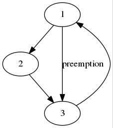
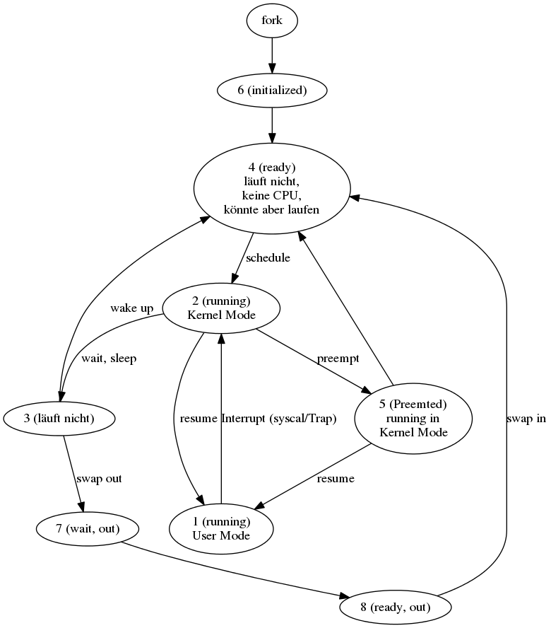
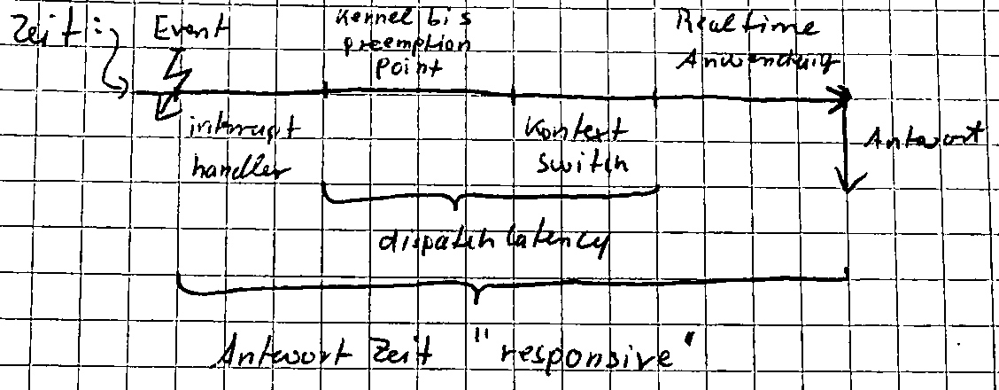

# Vorlesung Betriebssysteme 1

## Organisatorisches, Vorlesung vom 16.03.2016
1. Praktikum
    1. Start vsl. 04.04.2016
    1. Moodle-Passwort: DOS1.0
1. Themen
    1. Übersicht
    1. Grundlagen Rechnerarchitektur (RA)
    1. Prozesse, Threads, Interrupts
    1. Scheduling
    1. Synchronisation
    1. Memory Management (File System)
    1. (I/O)
    1. (Security)
    1. (Design & Implementation)
    1. (Virtualisierung)
    1. (Multiprocessors)
1. Klausur gemeinsam mit Vogt
1. Literatur
    1. Tanenbaum: Modern OS
    1. Silberschatz: OS Concepts
    1. Bovet: Understanding the Linux Kernel
    1. Russinovich: Windows Internals
1. Themen der heutigen Vorlesung
    1. Geschichte von Unix und Windows
    1. Was ist bzw. macht ein OS?
    1. User Mode und Kernel Mode

## Grundlagen Rechnerarchitektur (RA), 23.03.2016

### Wozu braucht das OS Hardware-Unterstützung?
Wiederholung: Wozu braucht man ein OS?

1. Schnittstelle für Systemprogramme
1. Schnittstelle für Anwenderprogramme
1. UI
1. Antwort: **Verwendung von Ressourcen, Rechten, Synchronisation und Kommunikation**

### Rechte
Die CPU hat einen Kernel-/Privileged-Mode und einen User Mode:

Kernel-/Privileged-Mode | User Mode 
---- | ---- 
alle Rechte | eingeschränkte Rechte |
x86 Real Mode: ohne Rechteverwaltung, Protected Mode: 4 priviledged Level | Tendenz: möglichst wenig im Kernel Mode machen (micro Kernel), User Mode Driver (Windows), User Mode File System (Unix) 
MMIX: negative Adressen | MMIX: positive Adressen 
Beschränkte Einsprungpunkte inkl. Rechtekontrolle | Wie kommt man in den Kernel Mode? a) Syscalls, interne Spezial-Instruktionen b) Interrupts; DTRAP/FTRAP, synchr. Interrupts Einschränkungen
 | Einschränkungen des Registerzugriffs; MMIX: rK, x86: PSW (program status word enthält die Mode Bits)
 | Einschränkungen bei den Instruktionen; x86 in/out (Zugriff auf Ports) `OR AX, 0xFF` und `OUT #21, AX`. `#21` ist das Interrupt Mask Register des PIC (Program Interrupt Controller)

### Ressourcen

1. CPU-Zeit: Userprozess darf CPU nur für eine bestimmte Zeit nutzen. Das OS hat und holt sich die Kontrolle zurück:
    1. syscall ==> Userprogramm muss warten
    1. timer interrupt; time slice läuft ab ==> Prozesswechsel
1. Memory
1. (Segmentation)
1. page tables (PT) ==> Im User Mode immer nur so: virtuelle Adressen (Programm/CPU), physikalische Adressen (Bus/RAM)
    1. Die PT ist eine Tabelle, die für jede *page number* eine *frame number* und außerdem Zusatzinformationen enthält.
    1. *page number*: `20 Bit + 12 Bit` offset
    1. 4 GB RAM und 32 Bit Adressraum ==> ca. 1 Millionen pages `2^20` und ca. 4 MB PT pro Prozess. Für die meisten Programme sind 4 MB PT viel zu viel.
        1. *Large tables* beim x86: 2 MB und 4 MB pages
        1. zweistufige PT
    1. Spezielle Caches TLB (Translation Lookaside Buffer) machen die PT-Übersetzung in Hardware mit 8 bis 256 Einträgen. 
    
## Prozesse Threads Interrupts, Vorlesung vom 30.03.2016

### Prozesse
* früher: 
    - Prozess = Job = Task
    - Speicher für Code und Daten
    - Rechte für Device-Zugriff
    - CPU für Ausführung von Code
* heute: 
    - komplexer durch Multiprogramming/-threading/-tasking
    - mehrere CPUs führen den Code gleichezeitig aus
    
### Threads
1. Abstraktion über die Anzahl der verfügbaren CPUs
1. Ein Thread verkörpert eine "virtuelle" CPU, die den Code ausführt
1. sind die ausführbaren Einheiten
1. **Exkurs** heute; Prozess = 
    - Adressraum ==> Zuordnung von Speicher nach Bedarf
    - Rechte ==> Zugriff auf "virtuelle Devices" über Handles (z.B. Filesystem)
    - Threads ==> Zuordnung von CPUs nach Bedarf = *Scheduling*
1. Ein Prozess hat mindestens einen - oft aber mehrere - Threads
1. alle Threads eines Prozesses teilen sich den gemeinsamen Adressraum (Speicher) und die gleichen Zugriffsrechte (Handles)
1. **Jeder Thread**
    1. hat seinen eigenen Registersatz, insbesondere Program Counter (PC) und Stack Pointer (SP),
    1. hat seinen eigenen Stack für lokale Variablen und Rücksprungadressen von Funktionen,
    1. und wird nach Bedarf und Verfügbarkeit eine CPU zugeordnet.

### Interrupts (Unterbrechnungen)
1. asynchrone/externe/HW-Interrupts
1. synchrone/interne/Exceptions/SW-Interrupts (z.B. Division durch 0, page fault)

#### HW-Interrupts

```
                      PIC (Programmable Interrupt Controller)   |
+---------+         +---------+                                 | MMIX
|         |---------|   IRQ   |                                 | +----+
|   CPU   |         |   IRM   |                                 | | rQ |-
|         |         +---------+                                 | | rK |-
+---------+          |||||||||      PIC                         | +----+
                           |_____+---------+                    |
                                 |   IRQ   |                    |
                                 |   IRM   | Interrupt Mask Register
                                 +---------+
                                  ||||||||| 
```

### Was passiert, wenn ein Interrupt auftritt?
1. externer Interrupt wird einer CPU zugewiesen. Interne Interrupts haben bereits eine CPU. 
1. CPU unterbricht Ausführung des laufenden Threads. 
1. CPU wechselt von User Mode in Kernel Mode.
1. Der Thread Kontext (PC, SP, ...) wird (teilweise) gesichert (context switch light). 
1. Der Interrupt Handler wird ausgewählt. Geschieht meist über eine Sprungtabelle (Interrupt Vektor)
1. Der Handler wird ausgeführt. 
1. Der Thread-Kontext wird wieder hergestellt.
1. CPU wechselt in User Mode.
1. Der Thread wird an der ursprünglichen Stelle weiter ausgeführt.

### Interrupt Priorities
1. Jeder Interrupt hat eine zugeordnete Priority.
1. Prio. des laufenden Threads in einem Register (CPU/PIC)
1. Interrupt mit höherer Prio. unterbrechen Interrupts mit niedrigerer Prio (wenn enabled).
1. (Bemerkung: Man kann Interrupt Priorities im Kernel auch für Synchronisation verwenden)

### Vorteile von Threads
1. Vermeiden von Wartezeiten auf IO
1. effizientere Nutzung der CPU
1. Echte Parallelität mit mehreren CPUs
1. Threadwechsel sind billiger als Prozesswechsel
1. Bessere Strukturierung von Programmen
1. Kommunikation zwischen Threads ist effizienter als zwischen Prozessen (über gemeinsame globale Datenstrukturen)

### Nachteile von Threads
1. Overhead Threadwechsel
1. Synchronisation ist komplex (data race)

### Zustände von Threads
Zustände von Threads (s. Abbildung)

1. running current: Thread hat CPU und läuft
1. blocked/waiting: Thread hat nichts zu tun und braucht keine CPU
1. ready: Thread könnte laufen, hat aber keine CPU


Hinweise:

1. Wenn dem OS die CPU entzogen wird, stehen **alle** User Level Threads
1. Wenn ein User Level Thread warten muss, müssen alle warten. 

## Prozesse, Threads, Interrupts am Beispiel Windows, Vorlesung vom 06.04.2016

### Prozesse

Threads

1. teilen sich den Adressraum
1. teilen sich die Ressourcen (Handles wie Datei, Fenster, Font, Thread, Prozess, ...)
1. getrennter, eigener Kontext (Register, Stack)
1. eigener user mode stack
1. eigener kernel mode stack

### Adressraum bei Win32

```
                +--------+
    FF FF FF FF |        |    - gemeinsam für alle Prozesse
                | Kernel |    - ca. 2 GB
                | Space  |
    80 00 00 00 |        |    
                +--------+
    7F FF FF FF |        |    - für jeden einzelnen Prozess
                | User   |    - ca. 2 GB
                | Space  |
    00 00 00 00 |        |
                +--------+
```

### Adressraum sonst

1. Bei Win64
    - 0,5 TB Kernel
    - 8 TB User Space
1. Ab Win2000
    1. Jobs: Mehrere Prozesse mit
        - gemeinsamer Priorität
        - gemeinsamen Ressourcenlimits (Ruhezeit, Disk Quota)
    1. Fibers: Mehrere User-Level-Threads innerhalb eines Kernel-Threads

### Schnittstellen (API) Win32

1. Win32 API
1. Posix API
    1. Subset funktioniert unter Windows
    1. hilft teilweise beim Portieren
1. (OS2 API, IBM)

### Prozess-Erzeugung (Win32 API)

```
BOOL CreateProcess(
    ApplicationName (string, *optional*)  // eines von beiden muss!
    CommandLine (string, *optional*)      // eines von beiden muss!
    ProcessAttributes (*optional*)
    ThreadAttributes (*optional*)
    InheritHandles (bool)
    CreationFlags {console, windows, unicode, debug, detached, ...}
    EnvironmentPointer (*optional*)
    CurrentDirectoryPointer (*optional*)
    StartupInfoPointer
    ProcessInfoPointer (out, *optional*) {ProcessHandle, ThreadHandle, ProcessID, ThreadID}
)
```

erzeugt den Prozess und den primären Thread. Der primäre Thread kann dann weitere Threads erzeugen.

### Thread-Erzeugung (Win32 API)

```
HANDLE CreateThread(
    ThreadAttributes (*optional*)
    StackSize
    StartAddress
    ParameterPointer (*optional*)
    CreationFlags
    ThreadIDPointer (out, *optional*)
)
```

**StackSize**:

1. Größe des User Space
1. wird auf ganze Seiten gerundet
1. wenn `StackSize == 0`, dann wir die `default` StackSize (1 MB) verwendet. 
1. Der Stack (Adressraum) wird **"reserved"** (invalid) und **"commited"** (reserved SWAP). Mehr darüber im Kapitel Memory Management.
1. Man bekommt nicht gleich 1 MB RAM, sondern nur 1 Page (ein Eintrrag in der page table)
1. Die restlichen Einträge der page table werden nur *reserviert* und bei Bedarf angelegt, wenn der Stack wächst. 
1. der so reservierte Adressraum kann für nichts anderes mehr verwendet werden, als für diesen Stack!

### Was heit commited?

1. Das Betriebssystem verpflichtet sich dazu, das nötige RAM bei Bedarf auch bereit zu stellen. 
1. Das Betriebssystem hat ein Commit-Limit, welches größer sein muss, als der gemeldete Stack. 
1. Die gemeldete Stackgröße wird dann vom Commit-Limit abgezogen. 

## Prozesse und Threads in Unix (Unix/Linux/Posix), Vorlesung vom 13.04.2016

### Wie erzeugt man in Unix einen Prozess?
1. `int fork();` keine Parameter
1. Rückgabewert
    * `< 0` Fehler
    * `= 0` Kind Prozess
    * `> 0` ProzessID des Kind-Prozesses im Eltern Prozess.
1. erzeugt ein Duplikat des laufenden Prozesses
    * ==> Sehr einfaches Konzept
    * ==> **Aber:**
        - Mutexe?
        - Handles?
        - Offene Dateien?
        - Threads? Nur der Thread, der fork() aufruft wird gestartet.
    * Es wird (wurde) **alles** kopiert!
    * Semantik ist nicht so ganz klar.
    * Speicher?
        1. heutzutage mit PageTables und "Copy on Write"
        1. Kopie der PageTables
        1. Sämtliche Einträge der PageTable werden *read only* gesetzt.
        1. "Leben im gleichen Speicher, solange nicht in diesen geschrieben wird."
        1. Beim ersten Schreibzugriff auf eine Seite bekommt man einen PageFault. Daraufhin bekommt jeder der Prozesse seine eigene Kopie.
1. Bootvorgang:
    * ProzessID 0 wird zum swap Prozess
        * mit fork() wird ProzessID 1 (init) erzeugt
            * init erzeugt alle weiteren Prozesse
                * getty
                    * bash
                        * gcc
                    * exit
                * weiterer Prozess
                * ...

#### Im Interrupt Handler
Beispiel: Eine einfache Shell

```
int main() {

char buffer[200];
int pid, status;

while(1) {
    fputs(">", stdout);
    fgets(buffer, 200, stdin); // lese input zeile in Konsole
    pid = fork(); // Prozess teilt sich auf: zwei bash

    if(pid < 0) {
        fputs("Error\n",stdout);
        return 1;

    } else if(pid == 0) { // "hier geht der Kind-Prozesses rein"
        buffer[strlen(buffer)-1] = 0; // Entfern \n am Zeilenende
        /*
         * Startet ein neues Programm, indem der gesamte Adressraum überschrieben wird.
         * Genauer: Die PageTables
         */
        status = execlp(buffer, "", 0);
        return status;
    } else { // "hier geht der Eltern-Prozesses rein"
        wait(&status); // wartet auf das Ende des Kind-Prozesses und erhält dessen Exit-Status.
    }
}
```

## Terminierung

1. `exit(status) // system call, geht an den Eltern-Prozess` ==> Files werden geschlossen Handles freigegeben.
1. Was passiert, wenn der Elternprozess nicht auf den Kindprozess wartet?
    * ==> Die Datenstruktur für den Prozess wird aufgehoben solange bis der Eltern-Prozess den Exitstatus bekommt.
    * ==> Der Kind-Prozess ist ein Zombie
    * Ausnahmen:
        - Der Eltern-Prozess kann das SIGCHLD Signal auch ignorieren oder abfangen.
        - Wenn der Eltern-Prozess vor dem Kind-Prozess temriniert, dann wird der Kind-Prozess (orphan, Waisenkind) vom init-Prozess adoptiert.

## Prozess-Zustände




## Scheduling, Vorlesung vom 20.04.2016

### Was ist Scheduling? 

Die Zuordnung von CPUs zu Threads. 

> Auf Servern eine wesentliche Aufgabe. Auf PCs ist die CPU hauptsächlich mit Warten beschäftigt. Auf Mobilgeräten ist es aufgrund der Akkulaufzeit relevant. Deswegen gibt es bereits viele Algorithmen für das Scheduling. 

### Was muss man beachten? Ziele? 
1. **Effizienz**: Jede CPU sollte soweit wie möglich genutzt werden.
1. **Fairness**: Jeder Prozess/Thread bekommt einen fairen Anteil an der CPU-Zeit. Insbesondere: kein Thread "verhungert" (starvation). 
1. **Responsiveness**: Die Wartezeit auf die CPU sollte nicht zu groß sein. 
1. **Realtime**: Die Antwortzeit auf Events hat eine obere Schranke. 

```
                                                   |
-----|--------------------|----------------|-------|----> Zeit
   Event      Warten   Scheduled        Antwort    |
                         CPU                    Schranke
```
### Methoden des Scheduling
1. **preemptive**: Threads werden nach einer vorher vorgegebenen Zeit (time slice, Quantum) abgebrochen und neu ge-scheduled.
1. **non-preemptive**: Jeder Thread darf so lange laufen, wie er etwas zu tun hat. 

### Verfahren 1: Round Robin Scheduling
Das Round Robin Scheduling (~ "im Kreis herum") ist ein wichtiges Basisverfahren. Dabei sind die Threads sind in einer zirkulären Liste (Queue) und kommen der Reihe nach dran. 

1. Der vorderste (laut Zeiger) bekommt die CPU für eine vorgegebene Zeit. 
1. Wenn die Zeit aufgebraucht ist, wird er wieder hinten eingereiht. 
1. Threads die Blockieren (warten müssen) werden aus der Queue entfernt. 
1. Threads, die aus dem Wartezustand wieder in den Ready-Zustand kommen, werden wieder in die Queue eingestellt. 
    - hinten in der Schlange ==> Muss noch eine Zeit lang warten.
    - vorne in der Schlange ==> Kommt gleich dran. 

Die entscheidende Frage bei diesem Verfahren ist, wie man das Quantum (Time Slice) wählt. 

1. nicht zu groß sonst leidet die Responsiveness)
1. nicht zu klein wegen des Kontext Switch Overheads

### Verfahren 2: Priority Based Scheduling
1. Jeder Prozess bzw. Thread hat eine Priorität. 
1. Der Thread mit der höchsten Priorität bekommt die CPU. 
1. Bei Threads mit gleicher Priorität wird meist das Round Robin Verfahren verwendet. 
1. Wenn ein Thread mit höherer Priorität nach *ready* wechselt, wird der Thread mit niedrigerer Priorität unterbrochen (preemption). 

Hier stellt sich die Frage, wie man die Prioritäten wählt?

1. Das Programm selbst legt die Priorität fest. 
1. Der Benutzer/Administrator legt die Priorität fest. 
1. Automatisch abhängig von der Prozessart (Foreground, Background, Interaktiv, Batchprocess)
1. Dynamische Anpassung der Priorität
    * normale Priorität/Base Priority
    * aktuelle/current Priority 
    * Scheduling erolgt aufgrund der current priority
    
### Beispiel
```
     CPU        CPU        CPU         CPU-Bound
----#####----->#####----->#####--->

   CPU    CPU    CPU    CPU    CPU     I/O-Bound
----#----->#----->#----->#----->#->   
```

Ziel: I/O-Bound-Prozesse bekommen eine höhere Priorität als CPU-Bound, weil die I/O nicht wesentlich von der CPU abhängig ist, sondern von der Lese- bzw. Schreibgeschwindigkeit der Disk. 

1. Interaktive Prozesse (z.B. Editor, Input, ...) bekommen eine höhere Aktivität. 
1. Foreground Prozesse bekommen eine höhere Priorität.
1. Prozesse, die schon sehr lange ready sind bekommen eine höhere Priorität. 

### Wann passiert das Scheduling?
1. Wenn ein Thread blockiert. 
1. Wenn das Time Slice aufgebraucht ist. 
1. Wenn die Blockierung eines Threads endet. 
1. Wenn ein neuer Thread startet.
1. Wenn ein Thread terminiert. 
1. Wenn sich die dynamischen Prioritäten ändern. 

### Wie passiert das Scheduling?
1. Scheduler läuft als Interrupthandler mit niedriger Priorität (bei Windows Level 2). 
1. Den Scheduler "aufrufen" heißt den entsprechenden Interrupt auslösen. 
1. Mehrfache "Aufrufe" ergeben nur einen Interrupt für den Scheduler.
1. Der Scheduler läuft nicht sofort, sondern erst, wenn die höheren Interrupts fertig sind. 
1. Kernel Threads können die Unterbrechnung durch den Scheduler verhindern, indem sie auf einem höheren Interrupt-Level laufen. 

### Wer ruft den Scheduler auf?
1. in einem system call (blockiert)
1. in einem I/O Interrupt (unblock)
1. im Clock Interrupt (preempt)

## Scheduling in Windows, Vorlesung vom 27.04.2016

1. Dispatcher läuft im Interrupt-Request-Level 2 (IRQ-Level2) 
    1. mit Prioritäten, 32 Level
    1. 32 Ready-Queues (Threads werden mittels round robin aktiviert. 
1. Wann läuft der Dispatcher?
        1. Wenn ein wartender Thread nach I/O completion ready wird. Windows ist [full preemptive](https://de.wikipedia.org/wiki/Multitasking#Pr.C3.A4emptives_Multitasking)
        1. Wenn ein Thread einen Event signalisiert. 
        1. Wenn das Quantum aufgebraucht ist. (clock interrupt ==> jetzt Zeitscheibe (preemption) zu Ende)
        1. Thread wartet auf IO (blockiert)
        1. Timed Wait wird fertig
1. Bit mask 32 Bit, 1 Bit pro Queue, "ready summary" zeigt an, welche Queues leer/voll sind. 
1. Bit mask 32 Bit, 1 Bit pro CPU, "idle summary" zeigt an, welche CPU idle/busy ist. 
1. Ablauf: Lock setzen, Zugriff bekommen, auf Queues arbeiten, freigeben
1. Modifikationen
    1. Prioritäten
        1. Klasse (pro Prozess) `SetPriorityClass`
            1. Idle -> 4
            1. BelowNormal --> 6
            1. Normale --> 8
            1. AboveNormal --> 10
            1. High--> 13
            1. Realtime --> 24
            1. 0 ist der Idle Thread
            1. 1 - 15 werden für User-Programme verwendet
            1. 16 - 31 sind Realtime-Threads
        1. Level (Thread) `SetThreadPriority`
            1. Idle --> 1 oder 16  (minimum)
            1. Lowest --> -2
            1. BelowNormal --> -1
            1. Normal -->  +/- 0
            1. AboveNormal --> +1
            1. Highest -->  +2
            1. Critical --> 15 oder 31 (maximal)
            1. ==>  Jeder Thread hat dadurch eine Base Priority
            1. ==> Die Base Priority wird dynamisch modifiziert --> **CurrentPriority; Wird für das Scheduling verwendet.**
            1. **keine** dynmaische Anpassung für Realtime-Threads
        1. Affinity
            1. Zuordnung von Threads zu CPU
            1. Jeder Thread hat einen idealen Prozessor ==> Thread läuft meist auf dem gleichen Prozessor (Vorteil: Daten bereits im Cache)
            1. hard affinity
                1. Jedem Thread werden fest CPUs zugeordnet
                1. Thread darf nur auf diesen CPUs laufen
            1. soft affinity
                1. Jedem Thread werden bevorzugte CPUs zugeordnet
                1. Thread sollte, wenn möglich, auf diesen CPUs laufen 
    2. Quantum
        1. 180 ms für Windows Server => längere Zeit ==> weniger context switches
        1. 30 ms für Work Station 
        1. 90 ms für den foreground Prozess bei Work Station
1. Dynamische Prioritätsanpassung
    1. `base priority <= current priority <= 15`
    1. Threads, die aufwachen, nachdem sie auf **I/O** gewartet haben, bekommen einen *priority boost* für ein Quantum. Der *boost* hängt vom Device ab:
        1. Disk, CD-Rom, ... --> +1
        1. Serielle IO, Netzwerk --> +2
        1. Keyboard, Mouse --> +6
        1. Sound --> +8
    1. Threads, die auf eine Windows-Message (User input) warten und ready werden, bekommen boost von +2 für ein Quantum.
    1. foreground Prozesse die ready werden, nachdem sie auf Mutex/Semaphore gewartet haben, bekommen auch +2 für ein Quantum.  
1. Anti Starvation boost (Starvation = verhungern; wenn ein Thread ready ist, aber nie die CPU bekommt)
    1. Einmal pro Sekunde wird geprüft, ob es einen Thread gibt, der schon mindestens 6 Sekunden ready ist. 
    1. Wenn ja, bekommt er Priorität 15 und dreifaches Quantum
    1. Der boost bleibt nur bis zur ersten Unterbrechung erhalten
1. [Priority Inversion](https://de.wikipedia.org/wiki/Priorit%C3%A4tsinversion) (???)
1. Multimedia Class Scheduler Service
    1. Applikation kann sich mit dem Service registrieren und wird dann speziell gescheduled
        1. high --> 23 - 26 (professionelle Multimedia-Software)
        1. Audio --> 16 - 22
        1. Normal --> 8 - 15
        1. Exhausted --> 1 - 7
1. Wie wählt Windows den nächsten Thread aus, wenn eine CPU frei wird?
    1. primary candidate: der erste Thread in der ready queue mit der höchsten Priorität. Er bekommt die CPU, wenn 
        1. er zuletzt auf dieser CPU lief, oder
        1. diese CPU seine bevorzugte CPU ist, oder
        1. er schon ca. 45 ms ready ist, oder
        1. die Priorität >= 24 ist.
    1. sonst: Suche nach anderem Thread, der eine dieser Kriterien erfüllt. 
    1. wenn keinen anderen gefunden --> primary candidate
    
## Scheduling unter UNIX, Vorlesung vom 04.05.2016

```
      /   BSD   \ 
     /           \
UNIX              ==>POSIX (Spezifikation der API)
     \           /
      \ SystemV /
``` 

1. Wie bei Windows
    1. Prioritätsgesteuert (Thread mit höchster Priorität bekommt die CPU
    1. Bei gleicher Priorität: Round Robin
    1. Dynamische Prio-Anpassung
1. default scheduling classes 
    1. 0 - 59 Timesharing Prios
    1. 60 - 99 Kernel Prios
    1. 100 - 160 Realtime Prios
1. Threads, die vom **user mode** in den **kernel mode** wechseln, bekommen eine neue Prio, die davon abhängt, was der Thread im Kernel macht. Wenn der Thread wieder in den **user mode** wechselt, bekommt er die alte Prio.
1. Threads im **kernel mode** werden nicht vorzeitig abgebrochen (**preemption**)
1. In modernen Unix-Versionen hat der Kernel **preemtion points**
1. Es gibt "scheduling classes". Diese definieren 
    1. eine Scheduling Policy
    1. einen Bereich von Prios
    1. das Quantum
    1. die dynamische Prio-Anpassungen

### Beispiel: Timesharing class hat eine Prio-Erhöhung, wenn ein Thread nach einem IO wieder ready wird. 

#### 2 Threads ohne IO mit einer CPU

```
---ready-----#running#---------ready---
                                       . . .
----------------------#running#--------
``` 

Bei 1000 Threads ist das für die Interaktivität tödlich: 30ms * 1000 = 30s der gleiche Thread

#### 2 Threads die hauptsächlich IO machen mit einer CPU

```
---ready-----#running#--waiting-###---waiting-------
                                                     . . .
----------------------###----------###---waiting----
``` 

Geschwindigkeit hängt hier von der IO ab. Was passiert, wenn alle auf einer CPU laufen ohne Prioritätsanpassung?

```
---#running#-----ready-----#running#

------------#running#---ready-------#running#

---------------------###--waiting--|--ready--###
                                   ^
------------------------###--waiting--|--ready--###-
                                      ^
                       Problem: Könnte schon, kann aber noch nicht.
``` 

Das Scheduling wird über eine dispatcher parameter Tabelle gesteuert:

| Prio | Quantum | Prio, wenn das Quantum vor maxtime endet | Prio, wenn das Quantum nicht in maxtime endet | nach Aufwachen aus sleep |
| --- | --- | --- | --- | --- | 
| 0 | 100 | 0 | 10 | 10 | 
| 1 | 100 | 0 | 11 | 11 | 
| 2 | ... | ... | ... | ... | 
| ... | ... | ... | ... | ... | 
| 15 | 80 | 7 | 25 | 25 | 
| ... | ... | ... | ... | ... | 
| 40 | 20 | 30 | 50 | 50 | 
| ... | ... | ... | ... | ... | 
| 59 | 10 | 49 | 59 | 59 | 

**maxtime**: Konstant, die festlegt, wann ein Thread sein Quantum aufgebraucht haben sollte. 

### Beispiel: Realtime Class
1. Wichtig: Vorhersagbarkeit der Antwortzeit
1. ganz einfaches Scheduling
1. Prio höher als im kernel mode
1. braucht Superuser-Rechte zum Starten
1. feste Prio, festes Quantum
1. Kernel Preemption points zur Verringerung der Antwortzeit: 



1. Viele Varianten
    1. Solaris (SUN)
        1. Kernel ist vollständig preemptive
        1. Nachteil: Die Datenstruktur im Kernel muss an vor simultaner Nutzung schützen (Mutex)
    1. Linux: anderes Konzept
        1. Priorität = Anteil der CPU-Zeit, die ein Thread bekommen soll relativ zu allen anderen (Beispiel: Prio 10 -> 20 % Anteil, 20 -> 40%, 3 -> 6%, 17 -> 34%, 50 -> 100%).
        1. Ein Thread der sein Quantum aufgebraucht hat, kommt so lange nicht mehr zum Laufen, bis alle anderen Threads, die ready sind, auch ihr Quantum aufgebraucht haben.
        1. nur eine queue für ready
        1. berechnet einen "goodness" Wert und lässt den besten Thread laufen
        1. inaktive Threads bekommen immer sofort ein neues Quantum

## Scheduler in Linux: The subroutine weight, Vorlesung vom 11.05.2016
1. Besprochen wird der Scheduler im Dokument [03_scheduling.pdf](other/03_scheduling.pdf) ab Seite 11
1. interrupt handler
    1. Code (Was ist zu tun?) wird in top und bottom half (alles andere) geteilt
    1. top wird sofort gemacht
        - schnell
        - nur das wichtigste enthalten
        - interrupts aus
    1. bottom später
        - kann dauern
        - alles andere später
        - interrupts an
1. Linux: Priorität = Anteil an der CPU-Zeit
1. `jiffies` ist eine Art interne Uhr und zählt die ticks seit dem letzten Boot. 
1. Der Linux-Scheduler läuft jedes mal, wenn der interrupt handler fertig ist (setzt ein Flag), sobald der interrupt level wieder 0 ist bzw. am Ende eines system calls. 

## Synchronisierung von Threads, Vorlesung vom 25.05.2016

1. Problemvoraussetzung
    1. Multitasking Betriebssystem
        1. mehrere gleichzeitig aktive Threads
        1. entweder parallel (mehrere CPUs) oder quasi parallel (single CPU)
    1. Non-disjoint Threads
        1. Disjoint Threads haben **keine** gemeinsamen Ressourcen (eher selten)
        1. Non-disjoint Threads haben gemeinsame Ressourcen (z.B. Memory, IO, devices, ...)
            1. cooperating Threads
            1. competing Threads (streiten sich um bestimmte Ressourcen)
1. Problem: Ohne Synchronisierung sind die Effekte von parallelen non-disjoint Threads weder vorhersehbar noch reproduzierbar. 
1. Beispiel Consumer-Producer-Problem mit einer verketteten Liste
    1. Webserver
        1. Input Thread
            1. liest Anfragen von Port 80
            1. Anfragen werden in eine verkettete Warteliste eingefügt 
        1. mehrere Worker Threads
            1. Nehmen Anfragen aus der Warteliste heraus
            1. Bearbeiten die Anfrage
            1. Schicken eine Antwort
    1. Beispiel Code in vereinfachtem C
    
```C

// löscht nächste Anfrage aus der Warteliste
url *delete(void) {

    while(First == NULL) sleep();

    request = First;
    First = request->next;
    request->next = NULL;

    return request;
}

```

```C

void insert(url *new) {
    
    if(First == NULL) 
        First = Last = new;
    else {
        Last->next = new;
        Last = new
    }
}

```

Bei fehlender Synchronisierung kann es passieren, dass zwei Threads das gleiche Element aus der Warteschlange bekommen:

```C

Thread 1            Thread 2

First == NULL?
request = Frist;
            ---->
                    First == NULL?
                    request = Frist;
                    First = request->next;
                    request->next=NULL
                    return request;
            <-----
First = request->next;
request->next=NULL // Problem: Speicherbereich ist bereits freigegeben worden
return request
            
```

1. Fortsetzung: Beispiel Consumer-Producer-Problem 
    1. Weitere Probleme ohne Synchronisierung können entstehen, wenn ein Thread `delete()` und ein Thread `insert()` ausführt. 
1. **Begriffe**
    1. *Race Condition*: Ergebnisse des Programms hängen vom relativen Verlauf der Threads ab. 
    1. *Critical Section*: Der Codebreich in dem Race Conditions auftreten.
    1. *Mutal Exclusion*: Methode zum Verhindern von Race Conditions: Es wird sicher gestellt, dass innerhalb einer *Critical Section* immer nur ein Thread aktiv ist. Die anderen Threads müssen warten. 
    1. *Deadlock*: Zwei Threads warten (unbeschränkt) einer auf den anderen. Beispiel: Threads brauchen beide Ressource A und B. 
1. Anforderungen an Programme mit parallelen Threads
    1. Keine Annahmen über die relative Ausführungsgeschwindigkeit von Threads.
    1. Vermeidung von Dead Locks
    1. Kein Thread muss unbeschränkt auf eine Critical Section warten.
    1. Ein Thread, der nicht in einer Critical Section ist, sollte nicht andere Threads blockieren.
1. Mutex: Variable die Mutal Exclusion impementiert. 

```
// naive Implementierung: Eine neue Critical Section entsteht zwischen LDO und STCO

MUTEX OCTA 0 // 0 frei, 1 belegt

AnfangCS    1H      LDO $0,Mutex    \  nennt man
            BNZ     $0, 1B          /  Spinlock
            STCO    1,Mutex         // --> belegt
            ...                     // critical section
EndeCs      STCO    0,Mutex         // --> frei            
```

1. Software Implementierung
    1. Dekker 1965, Trickreich!
    1. Peterson 1981, kompliziert!
    1. Lampert 1987, langsam! Spielt in der Praxis keine Rolle. 
1. Hardware-Unterstützung
    1. Intel x86, Exchange-Instruktion `XCH6 register, address` tauscht die Werte von Register und Speicher an der gegebenen Adresse
        1. hat automatisches LOCK-Prefix
        1. Verwendung als Mutex:
            1. Setze register auf 1
            1. `XCH6 register,Mutex`
            1. Teste, ob `register == 0`
            1. ja, war frei, ist jetzt besetzt
            1. enter critical section
            1. else (fange wieder oben an)
        1. `CMPXCH6 register,address` vergleicht den Inhalt des Speichers an der gegebenen Adresse mit dem A/AX/EAX register. Wenn beide gleich sind, werden die Inhalte von Register und Speicher getauscht und das Zero-Flag gesetzt, sonst: kein Tausch und Zero-Flag wird gelöscht. 
        1. Warum ist LOAD und STORE ohne Test ein Problem? Überlastung des Busses. 
    
## Synchronisation, Vorlesung vom 01.06.2016

1. Abgabetermin nächste Praktikumsaufgabe, 29.06.2016
1. Wiederholung letzte Stunde
	1. Mutex
	1. Ciritcal Section
	1. Race Condition
    1. Hardwareunterstützung
        1. XCH6, atomarer Lese-/Schreibzugriff
        1. TSTXCH6, atomares Lesen, Testen, Schreiben
1. Lock: Warten auf einen Mutex
    1. Busy waiting/Spin lock: Schleife = aktives Warten auf den Zugang zur critical section
        1. Nachteil: verbraucht CPU-Zeit
        1. Vorteil: kaum Overhead
            1. Nur auf Pages lagern, die nicht ausgelagert werden. 
            1. Was passiert, wenn der Thread, der den Mutex freigeben soll, das nicht tut?
    1. Alternative: Sleep/Wake bzw. Signal/Wait Funktionen
        1. Warteschlange für Threads, die vom BS unterstützt wird.
            1. `wait(), sleep()`: Thread wird in die Warteschlange eingefügt ==> Zustand geht von "ready" nach "waiting" (ähnlich wie bei abgelaufenenm Quantum)
            1. `Signal(), wake()`: Der erste Thread in der Warteschlange wird wieder aktiviert. Zustand geht von "waiting" nach "ready"
        1. Nachteil Overhead:
            1. Wechsel ins BS
            1. Kontextswitch
            1. Warteschlange
            1. Kontextswitch
            1. Wechsel in User Space                
        1. Vorteile: 
            1. Keine Verschwendung von CPU-Zeit. Lohnt sich bei aufwändigen critical sections
            1. Mutex kann vom BS freigegeben werden

### Beispiel: Producer Consumer Problem **mit beschränktem Buffer und sleep/wake**

```C
#define MAX 100
int count = 0; // leer
Mutex in, out; 

void producer() {
    while(1) {
        produce(item);  
        if(count == MAX) *1 sleep(in); // Buffer voll ==> warten
        insert(item);   
        count++;
        if(count===1) wake(out); // consumer aufwecken
    }
}

void consumer() {
    while(1) {
        if(count==0) sleep(out); // Buffer leer ==> warten
        delete(item);
        count--;
        if(count==MAX-1) wake(in); // producer aufwecken
        consume(item)
    }
}
```

1. Was passiert, wenn bei *1 ein Prozesswechsel auftritt? Es kann zum Deadlock kommen. 
1. Lösung des Deadlocks: Signal/Wait mit Signal Pending Bit. Das Vorhandensein des Signals wird gespeichert. 
1. **Semaphore**
    1. Zähler der atomar inkrementiert und dekrementiert wird.
    1. Minimalwert (0), fester Maximalwert
    1. Thread wird blockiert, falls das herauf oder herunterzählen nicht möglich ist. 
    1. Spezialfall: `Maximalwert == 1`, ähnlich wie ein Mutex
    1. down operation: P-Operation zählt herunter
    1. up operation: V-Operation zählt hoch
    
### Beispiel: Producer/Consumer Problem mit beschränktem Buffer und Semaphoren

```
semaphore(1)    mutex=1;
semaphore(MAX)  empty=MAX;  // Anzahl leerer Felder
semaphore(MAX)  full=0;     // Anzahl voller Felder

void producer() {
    while(1) {
        produce(item);  
        down(empty);
        down(mutex);
        insert(item);   
        up(mutex);
        up(full);
    }
}

void consumer() {
    while(1) {
        down(full);
        down(mutex);
        delete(item);
        up(mutex);
        up(empty);
        consume(item)
    }
}

```

### Synchronisation in Windows - Die wichtigsten API Calls

1. Low Level Methoden
    1. **InterlockedAdd** (und viele mehr): atomare addition von zwei Integern
        1. Compilerunterstützte "Intrinsics"
        1. wird möglichst im Userspace gemacht
    1. **Critical Section** (Betriebssystemunterstützung)
        1. Datenstruktur im User Space 
            1. `Initialize Critical Section()`
            1. `EnterCriticalSection()`
            1. `LeaveCriticalSection()`
        1. Nur innerhalb eines Prozesses. 
        1. ==> Vorteil: Sprung ins BS nur, wenn der Thread warten muss.
        1. flexibel
        1. fehleranfällig z.B. aufgrund fehlendem `LeaveCriticalSection()`
        1. effizient
        1. optionaler *spin count*; Wechsel nur ins BS mit sleep nur, wenn die Schleife abläuft
    1. **Slim Reader Writer Locks** (**SRW**, später mehr!) 
1. Higher Level Methoden
    1. Vorteile: Eignen sich für die Synchonisierung von threads in **verschiedenen Prozessen**.
    1. Nachteil: Höherer Overhead (Kontextswitch)
    1. Gemeinsam
        1. Zugriff über Handles
        1. Wait for `SingleObject()`
        1. Wait for `MultipleObjects()` gemeinsame Wartefunktionen
            1. Mögliche Objekte
                1. Mutex
                1. Semaphore
                1. Events (z.B. Signal/Wait)
                1. Timer
                1. IO, Sockets, Console, ...
                1. Adresse (z.B. Schreibzugriff auf bestimmte Adresse)
                1. Thread-/Prozessterminierung
    
## Highlevel Synchronisation in Windows, Vorlesung vom 08.06.2016

1. Rückmeldung zum Praktikum
	1. quantitativ
        1. Nicht "ziemlich viel besser"
        1. besser:
            1. 12,3% 
            1. 40000 statt 30000 Cycles
    1. Context Switch Delta ist kein Maß für Performance
        1. ==> IO writes
        1. CPU Cycles
    1. zu 1d) Priority Boost
        1. 8 normal
        1. 9 normal + 1 (IO Boost)
        1. 11 normal + 2 + 1 (IO boost und foreground)
        1. 15 starvation boost 
        1. CPU-Stress normal 8 + AboveNormal = 9, IO intensiv + 10 boost = 9
    1. Quantum hat nichts mit Priorität zu tun. 
1. Highlevel Synchronisation in Windows
    1. Kernel Objekte
    1. Programm bekommt ein [Handle](https://de.wikipedia.org/wiki/Grillhendl)
    1. Können zwischen verschiedenen Prozessen gemeinsam genutzt werden. 
    1. Wait for single Object (andle)
    1. Wait for multiple Objects (Handle[])
    1. `CloseHandle()` als Gegenstück zum `Createxxx...`
    
### Mutex (ist das Einfachste)

``` 
HANDLE CreateMutex()    // erzeugt den Mutex
HANDLE OpenMutex        // gibt Handle auf einen existierenden Mutex

Release Mutex()
     /\
     ||
     \/
WaitForSingleObject(),

    Verwendung
        .
        .
        .
WaitForSingleObject(MutexHandle),
        .  \
        .   |- critical Region
        .  /
Release Mutex(MutexHandle)
        
``` 

### Events (Reine Warteschlange)

1. Handle CreateEvent()
1. Handle OpenEvent()
1. SetEvent() weckt Threads auf, die gerade auf das Event warten. 
1. ResetEvent() Threads müssen wieder warten
1. AutoResetEvent ein ResetEvent wird automatisch ausgeführt, sobald ein Thread aufgeweckt wird. 
1. PulseEvent dient zum Aufwecken einer festen Anzahl von Threads

### Semaphore; Eine Art Zähler der zwischen 0 und MAX herauf- oder heruntergezählt wird. 
1. CreateSemaphore
1. OpenSemaphore
1. WaitForSingle-/MultipleObject = Down Operation
1. ReleaseSemaphore = Up Operation

### Reader-Writer Problem
1. Reader Threads liest die Datenstruktur
1. Writer Threads lesen und schreiben die Datenstruktur
1. Sehr viel mehr Reader als Writer
1. Reader kann man gut parallel zulassen
1. Writer nur exklusiv
1. Ein Lock für die gesamte Datenstruktur und ein Zähler für die aktuell aktiven Reader
1. Fine grained locking: Einzelne Records werden gelocked
1. Lock free methods, z.B. Hazard Pointers
    1. jeder Thread hat einen oder mehrere davon in lokalen Variablen
    1. Vor dem Zugriff auf einen Datensatz wird der Zeiger in den Hazard Pointer kopiert. Danach wieder gelöscht. 
    1. Der Writer liest alle Hazard Pointer und wartet solange bis kein Thread mehr den Datensatz nutzt. 
    
## Synchronisation in Unix, Vorlesung vom 15.06.2016

1. Frühes Unix
	1. sehr prozessorientiert
	1. Synchronisation kompliziert zu programmieren.
    1. relativ ineffizient
1. Späteres Unix repariert die meisten Probleme
1. Methoden
    1. MessageQueues, ähnlich zu Windows, aber selten genutzt
    1. Semaphore, eher typisch
    1. Signale, wichtig
    1. Shared Memory (später mehr)
    1. Pipes (wichtig)
    1. Sockets
1. Für Signale gibt es Betriebssystemfunktionen:
    1. `sigaction()` setzt einen Signalhandler
    1. `sigprocmask()` maskiert Signale
    1. `sigsend` senden von Signalen
    1. `alarm()` setzt einen Timer
    1. `wait()` warten auf Signale
1. Semaphore Funktionen
    1. `id = semget(key, sem_num, flag)`
        1. `id` Handle für das Semaphore Set
        1. `segmet` erzeugt oder öffnet ein Set von Semaphoren
        1. `key` User defined "Name"
        1. `sem_num` Anzahl im Set
        1. `flag` Create oder Open
    1. oldval = semop(id, oplist, count);
        1. `semop`
        1. `id`
        1. `oplist` Liste von up/down operationen (sem_num: Nummer der Semaphore, sem_op: < 0 = down, > 0 up, sem_flag)
        1. `count`
    1. Alle Operationen in der Liste werden atomar ausgeführt. 

### Memory barriers:

**Beispiel**

```
int value=0;
int ready=0;

Thread 1                Thread 2
    .                       .
    .                       .
    .                       .
value=42;             while(!ready)
---> release barrier   ---> acquire
ready=1;              return value;
    .                       .
    .                       .
    .                       .
    
```

In modernen Computersystemen ist die Reihenfolge von Speicherzugriffen in einem Thread unabhängig von der Reihenfolge in dem diese Zugriffe in einem anderen Thread beobachtet werden. Erklärung: Speicherhierarchie. Was passiert bei einem Speicherzugriff:

```
        TLBlookup                      L1-Cache                  L3-Cache
|----->|--------->| ----------------->|------>|------------>|------------------------>|---- ... ---->|
Adressberechnung     Pagetable lookup             L2-Cache                              RAM-Zugrif
(virtuell)              (optional)                                                      dauert lange!

```

```
1H  LDO $0,ready
    BZ  $0,1B
    -------------- SYNC einfügen für memory barrier
    LDO $0,value
    POP 1,0
```

Es gibt zwei Sorten von Memory Barriers:

1. aquire, ein load oder store nach der barrier wird erst begonnen, wenn das load vor der barrier abgeschlossen ist. 
1. release, ein store nach der barrier wird erst ausgeführt nachdem alle loads und stores vor der barrier abgeschlossen sind. 
1. Beides zusammen nennt man memory fence

```
 | load/store |                 store
 -------------- release     -------------- acquire
     store                  | load/store |
```

Das wäre zu teuer, da es keine Parallelität mehr gäbe. 

```
  store
 -------
  load

``` 

### Memory Management
Konzepte fürs Multiprogramming

1. Segmentierung/Partitionierung
    1. Ein Prozess bekommt ein oder mehrere Segmente
    1. Schutz der Prozesse voreinander
    1. Auslagern eines Prozesses (swapping)
    1. zusammenhängende Speicherbereiche im Segment 
    1. einfach zu implementieren
    1. Intel x86
        1. 16 Bit Computer 8086
        1. 4 Segmentregister a 16 Bit: CS, DS, SS, ES
        1. Jeder Befehl spezifiziert implizit eines/mehrere dieser Segmentregister
        1. ` #### SEGMENT #### << 4`
        1. `+ ____#### OFFSET ####`
        1. `----------------------`
        1. `20 Bit = 1 MB`
        1. heute, ab 386 gibt es 6 Segmentregister ES, FS, GS 
        1. die Segmentregister sind Indizes in die local/global descriptor table: 8K -> `Adresse = Basisadresse (size, flags) + offset <= size`
## Paging, Vorlesung vom 22.06.2016 
// TODO BILD

1. Vorteile
    1. flexibel
    1. kaum Fragmentierung
    1. erzeugt keinen Aufwand für den Programmierer
    1. dynamische Anpassung der Tabelle
1. Nachteile
    1. zwei Speicherzugriffe
    1. braucht Hardwareunterstützung (TLB)
    1. Pagetables können sehr groß werden
1. Caches: AMD Opteron
    1. Level 1 Cache 64 kByte Instruktionen und 64 KByte Daten
    1. Level 2 Cache 512 kByte
    1. Level 3 Cache 2 MByte
    1. TLB (Translation Lookaside Buffer) spezieller Cache für Adressübersetzung
    1. DataTLB
        1. Level 1 64 Einträge voll assoziativ 
        1. Level 2 512 Einträge 4-fach assoziativ
    1. InstructionTLB
        1. Level 1 32 Einträge voll assoziativ
        1. Level 2 512 Einträge 4-fach assoziativ
1. Paging kann mit Segmentation kombiniert werden. 
1. Beim MMIX gibt es 4 Segmente (Datensegment, ...) mit jeweils einer eigenen Pagetable
    1. Wie groß wird eine Pagetable?
    1. ```

     ################################################################
     ^^^\______________________________________________/ offset          
     ||              48 Bits page number 
     |Segment (2 Bits)
     Kernel Mode (1 Bit)```  
    1. 2^48 Einträge in der page table (s. Abbildung)? 
    1. 2^51 Byte -> 2 PetaByte page table. Das ist zu groß
    1. Lösung: Mehrstufige page tables
    1. Intel x86
        1. 2 Segmenttabellen (Global Descriptor Table und Local Descriptor Table) mit virtuellen Adressen
        1. 1 Pagetable für alle virtuellen Adressen
1. Verwaltung des freien Speichers, 3 Methoden:
    1. Bitmaps
        1. 0 = page ist frei
        1. 1 = page ist belegt
        1. kleiner Overhead
        1. Beispiel: 16 GByte Speicher 
            1. --> 1 Bit pro 2^15 Bit
            1. 2^34 Byte = 2^22 pages --> 2^22 Bit = 2^19 Byte = 512 kByte Bitmap
    1. Verkettete Listen
        1. Strategrie bei der Allokation: 
            1. First Fit (erster Block)
                1. Vorteile: schnell
                1. Nachteil: Fragmentierung
            1. Best Fit (kleinster Block)
                1. Vorteile: bisschen langsamer
                1. Nachteil: weniger Fragmentierung
            1. Worst Fit (größter Block)
                1. Vorteile: maximal große Reste
            1. Meist nimmt man First Fit mit einem Rover (Stelle mit dem letzten Fit)
        1. Problem: Freigabe
            1. Für belegte Blöcke Größe mit abspeichern --> mehr Overhead (normalerweise Promillebereich)
            1. Zusammenfügen von freien Blöcken --> Suche über freie Blöcke (aufwendig)
    1. Buddy System
        1. Blockgrößen sind Potenzen von 2
        1. Beispiel: 16 GByte
            1. größter Block: 8 GByte = 2^33 Byte
            1. kleinster Block: 16 Byte = 2^4 Byte
        1. Für jede Größe gibt es eine verkettete Liste mit freien Blöcken
        1. Wenn die gewünschte Größe nicht mehr vorhanden ist, nimmt man den nächst größeren Block und halbiert ihn. Buddy enstpricht den beiden Hälften. Das oberste Bit des "rechten" Buddies ist 1 und kann daran erkannt werden. 
        1. Zusammenfügen einfach, weil man den Buddy an der Adresse erkennt. 
        1. Bei größeren Blöcken Unterstützung durch Bitmaps
        
## Memory Management in Unix/Linux, Vorlesung vom 29.06.2016

1. kleiner Teil wird statisch für den Kernel allokiert
1. dynamisch
    1. Paged Pool (können ausgelagert werden)
    1. Nonpaged Pool (werden nicht ausgelagert)
    1. In beiden dynamischen Bereichen werden die freien Blöcke mit einer der besprochenen Methoden (Bitmaps, Buddy, linked list, ...) verwaltet. 
1. wichtig für Effizienz
1. wird häufig genutzt
1. Abkürzungen
    1. look aside lists
    1. eigene Listen für von Kernel häufig gebrauchte Größen
    1. seperate Listen pro CPU
1. Datenstrukturen für das Paging
    1. Kernel braucht zusätzlich zu den page tables noch Datenstrukturen, um Informationen für die Seiten im paged pool zu verwalten (page frame data structure). 
    1. free/used
    1. Liste der Prozesse die sie benutzen
    1. Liste der page tables entries
    1. backing store
    1. protection bit: r, w, x
    1. valid Bit 
    1. modified Bit, dirty Bit
    1. referenced Bit 
    1. Copy on write Bit 
    1. demand zero Bit 
1. Page Deamon wird vom Kernel aufgerufen, wenn die Anzahl leerer Seiten unter eine bestimmte Grenze fällt. Versucht freie Seiten zu erzeugen, braucht dafür page replacement Strategie
    1. least recently used (LRU)
        1. Variante Load und Store Befehle setzen im TLB das Referenced Bit
        1. Betriebssystem löscht in regelmäßigen abständen diese Bits
        1. Dadurch ist feststellbar, welche Seiten in letzter Zeit benutzt wurden
    1. First in First Out (FIFO, z.B. Windows)
        1. einfach zu implementieren
        1. geht ohne Hardwareunterstützung
    1. Global Replacement und local Replacement
        1. local (Windows): wenn Prozess X eine Seite braucht wird auch eine Seite von Prozess X ausgelagert
        2. global: wenn Prozess X eine Seite braucht wird unter allen Seiten von allen prozessen die günstigste zum Auslagern gesucht. 
    1. Second Chance Algorithmus (Variante des Reference Bit Algorithmus): man nimmt den ersten ohne Reference-Bit. Bei Pages mit Reference-Bit löscht man das Bit und stellt sie ans Ende der Schlange.
1. Demand Paging
    1. Seiten werden erst geladen, wenn sie egebraucht werden
    1. demand zero pages: eine Seite wird mit 0 gefüllt und zugeordnet, z.B. mit 0 initialisierte Datenbereiche wie Stack oder Heap --> soft page fault
    1. pages im backing store (auf der Platte) --> hard page fault
    1. pages in Memory --> soft page fault
1. Speicher Schutz
    1. Über page tables und segment tables wird der Speicher vor unberechtigtem Zugriff aus anderen Prozessen geschützt
    1. Mit protections Bits schützt man den Speicher vor unbeabsichtigten Zugriffen
    1. Der Compiler/Linker organisiert das Programm in verschieden Sections/segments mit verschiedenen Rechten
1. Eine Anwendung des Speicherschutzes ist Shared Memory: Ein Bereich des RAM wird mehreren Prozessen zugeordnet --> effiziente Methode für interprozess Kommunikation
1. Implementierung von `fork()` mit copy-on-write
    1. erzeugt eine komplette Kopie des aufrufenden Prozesses
    1. fork macht eine Kopie der page table und setzt in beiden page tables/page frame data structures das copy-on-write bit. 
    1. Wenn der erste Prozess einen Schreibzugriff ausführt entsteht ein page fault.
    1. Der page fault handler kopiert die Seite, löscht für beide Prozesse das copy-on-write bit und setzt für beide Seiten das write bit
1. Prepaging
    1. Wenn ein page fault eine Seite (z.B. Code) anfordert lädt man gleich ein ganzes working set. 
    1. Seiten proaktiv in den swap space schreiben

## Zusammenfassung und Klausurhinweise, Vorlesung vom 06.07.2016

### Themen und Stichwörter

1. Aufgaben von Betriebssystemen
    * Ressourcen (Schutz)
    * Rechte (Schutz)
    * User Mode vs. Kernel Mode
    * System Call
    * Interrupt/Event
    * API
1. Prozesse und Threads
    * Erzeugung und Terminierung
    * Prozess/Thread Zustände (ready, running, waiting, ...)
    * Code, Data, Kontekt (Register), Stack
    * fork/exec
    * CreateProcess/CreateThread
1. Interrupts
    * Priority
    * Interrupt Level
    * Interrupt Number
    * Handler Table/Handle
    * synchron (intern)/asynchron (extern)
    * Markieren
1. Scheduling
    * Zuordnung CPU-Thread
    * Thread-Zustände (nochmal)
    * Quantum, Preemption
    * Windows/Linux -> Rechenzeit-Prio-Verhältnis
    * Prioities: base, dynamic, priority boost
    * Starvation
    * Round Robin
    * Soft Affinity/Hard Affinity
    * Scheduleraufruf; Wann und von wem?
1. Synchronisierung
    * Race Condition
    * Critical Section
    * Mutual Exclusion
    * Fairness
    * Spinlock/Signal und Wait
    * Atomic Read/Write: Read/Test-Write
    * Mutex
    * Semaphore
    * Beispiel Consumer/Producer, Reader/Writer   
1. Memory Management
    * Segmentation
        - base, size, permissions
        - segment table
        - swapping
    * page frame data structure (frame number, page, valid, used, free, copy on write, ...)
    * page fault (soft, hard)
    * Paging/Virtual Memory
        - virtuelle/physikalische Adressen
        - Adressübersetzung
        - Pagetables
        - mehrstufige Pagetables
        - PageNumber; FrameNumber
        - offset
        - page size
        - permissions
    * TLB Caches
    * Demand Paging
    * Page Replacement Strategy (local, global, prepaging, buffering, locking, LRU, second chance, ...)

### Mögliche Fragen und Stichwörter

1. Quantum, Round Robin, Pagetable
1. Unterschiede: Segmentation, Paging bei Windows und Linux
1. Was passiert im OS, wenn
    1. Prozess erzeugt,
    1. Thread beendet,
    1. Interrupt oder Page Fault eintritt,
    1. Quantum abläuft?
1. Welche Ressourcen braucht das OS, wenn/für ...
1. Wie groß ist ein ..., Wie misst man ...
    1. Pagetable, wenn Entry 8 Byte und Index von 10 Bit
    1. Seitengröße bei 8 Bit Offset
1. Wie viele Threads kann man starten, wenn jeder 1 MB STack braucht?
    1. Welche Parameter sind einstellbar?
    1. Grenzen
    1. Probleme
    
    
